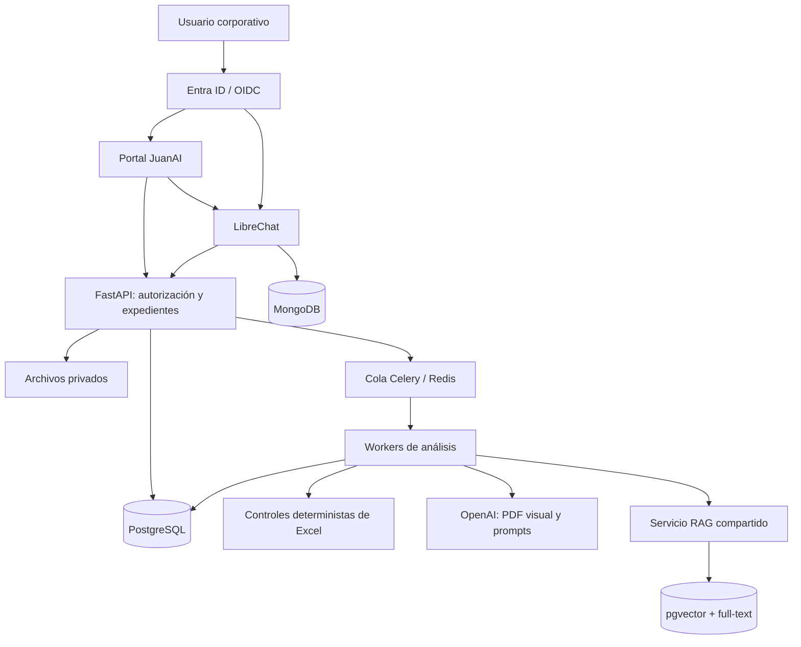

# Arquitectura objetivo de JuanAI

Estado: base técnica seleccionada para implementar el MVP. El tenant, dimensionamiento y versiones se fijan con TI al iniciar el desarrollo.

## Objetivo

Procesar muchas propuestas pequeñas de tratamiento de agua con el menor error posible. JuanAI recibe diseños, planos, costeos y antecedentes; los contrasta con conocimiento autorizado, detecta inconsistencias, formula preguntas y conserva evaluaciones auditables. La generación de borradores técnico-comerciales queda para una fase posterior y siempre requiere aprobación humana.

## Componentes seleccionados

| Capa | Tecnología | Responsabilidad |
| --- | --- | --- |
| Portal | HTML/CSS/JavaScript modular, reutilizando componentes ECO | Carga, seguimiento, resultados, preguntas, prompts y administración |
| Identidad | Microsoft Entra ID mediante OpenID Connect | Inicio de sesión corporativo y pertenencia a grupos |
| Autorización | FastAPI + PostgreSQL | Roles, permisos por expediente/área y políticas de acceso |
| API | Python/FastAPI | Casos, documentos, evaluaciones, reglas, conocimiento y auditoría |
| Procesamiento | Celery + Redis + workers Python | Trabajos largos independientes del navegador, reintentos y control de cuotas |
| Estado durable | PostgreSQL | Casos, revisiones, trabajos, resultados, decisiones y logs funcionales |
| Archivos | Almacenamiento privado de archivos/objetos | Originales, versiones, evidencias y exportaciones |
| RAG | LangChain acotado al servicio de recuperación | Ingesta, división, recuperación y composición de contexto |
| Recuperación | PostgreSQL + pgvector + búsqueda textual | Semántica, términos exactos, TAGs, modelos y filtros de vigencia/permisos |
| Modelos | API OpenAI | Análisis visual de PDF, extracción y razonamiento con salidas estructuradas |
| Costeo | openpyxl + reglas propias y motor compatible cuando corresponda | Fórmulas, valores, celdas, unidades, monedas y comprobaciones reproducibles |
| Chat | LibreChat conectado a la API JuanAI | Preguntas y acotaciones sobre expedientes autorizados |
| Datos del chat | MongoDB de LibreChat | Conversaciones y configuración propia de LibreChat |
| Despliegue inicial | Docker Compose | Servicios aislados en infraestructura autorizada por TI |

LangGraph, MCP, n8n y conexión SharePoint nativa no forman parte del MVP. Pueden incorporarse si aparece una necesidad concreta. La primera entrada es carga manual; INET y SharePoint se integran después.

## Flujo técnico

El navegador inicia y observa trabajos; no ejecuta la secuencia. PostgreSQL conserva el estado canónico. Redis transporta tareas y no reemplaza la base durable. Los workers usan identificadores idempotentes, checkpoints y reconciliación después de interrupciones.

## Seguridad y roles

- **Administrador:** usuarios, fuentes, configuración y publicación de prompts.
- **Ingeniero:** carga y análisis de expedientes autorizados; responde aclaraciones.
- **Revisor técnico/comercial:** valida o corrige hallazgos y aprueba conocimiento dentro de su ámbito.
- **Lector/auditor:** consulta resultados e historial sin modificar evaluaciones.

Los permisos se aplican a documentos, resultados, descarga, recuperación RAG, chat y exportaciones. LibreChat no consulta directamente tablas o archivos sin autorización de JuanAI. Toda acción relevante registra usuario, fecha, objeto y cambio. Los costos, márgenes y documentos de proveedores admiten clasificación de confidencialidad y segregación por proyecto o área.

## Análisis de una propuesta

1. Crear expediente, seleccionar tipo de propuesta y adjuntar archivos.
2. Inventariar documentos, calcular huellas y registrar revisiones.
3. Validar formatos y cobertura de lectura; separar ilegible, faltante y vacío.
4. Extraer Excel preservando hoja, celda, fórmula, valor guardado, unidad y moneda.
5. Analizar visualmente planos y reportes PDF con evidencia de página/región.
6. Consultar conocimiento vigente y autorizado mediante recuperación híbrida.
7. Ejecutar reglas deterministas y prompts pertinentes al tipo de propuesta.
8. Consolidar errores, discrepancias probables, mejoras y preguntas.
9. Registrar respuestas y ejecutar solamente dependencias afectadas.
10. Publicar una nueva versión del resultado sin borrar evaluaciones anteriores.

Los controles aritméticos y referencias de Excel se resuelven en código. El LLM interpreta planos, correspondencias y contexto. Los hallazgos de alto impacto o baja certeza requieren revisión dirigida.

## Conocimiento y aprendizaje

La base distingue:

- **Biblioteca aprobada:** criterios internos, manuales, listas y documentación vigente.
- **Expediente:** archivos y resultados de una oportunidad concreta.
- **Históricos validados:** propuestas, correcciones y lecciones aprobadas para reutilización.
- **Casos negativos:** errores conocidos acompañados de su corrección.

Cada fuente conserva propietario, vigencia, revisión, fabricante/modelo, confidencialidad y ámbito. Una propuesta ganada o una conclusión automática no se convierte por sí sola en regla.

Para parámetros de agua se separan el catálogo común, los valores del proyecto y los rangos aprobados por aplicación. Las simulaciones del expediente real son escenarios concretos. El documento “Equipos y Criterios de Proceso VF” debe elaborarse y aprobarse con especialistas antes de automatizar conclusiones técnicas que dependan de sus límites.

## Prompts y resultados

Los prompts mantienen la lógica probada en ECO: tareas delimitadas, instrucciones expertas y contratos JSON protegidos. La interfaz permite editar criterios e instrucciones; publicar una versión exige autor, fecha y pruebas. Una evaluación registra documentos, reglas, prompt y modelo utilizados.

Familias iniciales:

- Clasificación, revisiones y completitud documental.
- Extracción de equipos, parámetros y etapas.
- Lectura visual de plano.
- Conciliación plano, corrida, proyección química y costeo.
- Coherencia técnica, económica y comercial.
- Recuperación de antecedentes aprobados.
- Preguntas, respuestas e impacto.
- Consolidación de resultados y chat sustentado.

Cada hallazgo incluye tipo de control, valores comparados, unidad, regla/prompt, fuentes, severidad, certeza, cobertura, acción y decisión del revisor. El chat puede crear una observación; no sobrescribe el análisis aprobado.

## Roadmap

| Fase | Alcance | Salida verificable |
| --- | --- | --- |
| 1. Caso real | Lectores PDF/XLSX, esquema de resultados y controles iniciales | Referencias rotas, vacíos y evidencia por página/celda |
| 2. Plataforma | SSO, roles, expedientes, archivos y cola durable | Acceso segregado y recuperación tras cierre/reinicio |
| 3. Evaluador | Plano-costeo, cantidades, fórmulas, unidades y parámetros | Casos correctos y errores conocidos validados por experto |
| 4. RAG y aclaraciones | Biblioteca, recuperación híbrida y ciclo pregunta-respuesta | Fuentes vigentes, permisos y reproceso de dependencias |
| 5. Chat y prompts | LibreChat y editor versionado | Mismo corpus/permisos; auditoría de cambios |
| 6. Piloto operacional | Carga, respaldo, costo, calidad y ahorro | Umbrales aceptados por negocio |
| Posterior | INET/SharePoint, más familias y borradores | Integraciones y plantillas aprobadas |

La estimación histórica de 10–15 semanas es orientativa. Se recalibra al finalizar la fase 1, con equipo, accesos, volumen y disponibilidad del experto definidos.

## Criterios de éxito

- Precisión y cobertura por tipo de control, no una nota global aislada.
- Errores reales detectados, falsos positivos y errores omitidos.
- Evidencias correctas y fuentes vigentes.
- Tiempo humano neto y costo por propuesta.
- Recuperación tras fallas y ausencia de ejecuciones duplicadas evitables.
- Cumplimiento de permisos en portal, chat, RAG y descargas.
- Reducción de reproceso y correcciones posteriores.

El expediente revisado y sus consecuencias están en [PILOTO_DOCUMENTAL.md](PILOTO_DOCUMENTAL.md). La evidencia del sistema ECO está en [AUDITORIA_TECNICA_V069_Y_ROADMAP.md](AUDITORIA_TECNICA_V069_Y_ROADMAP.md).
