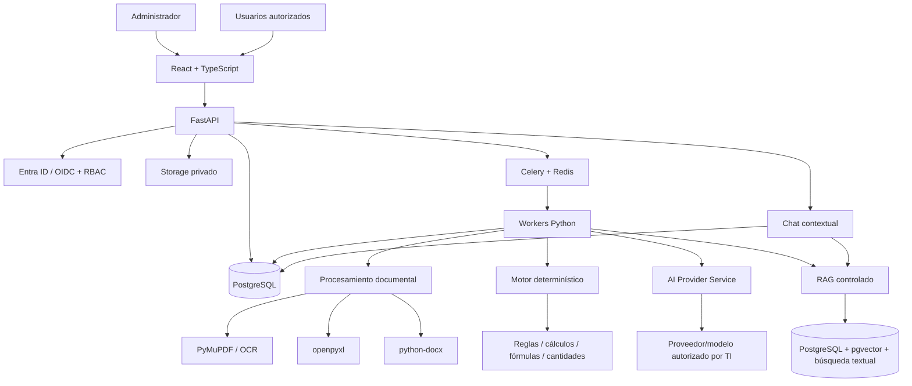

# Arquitectura objetivo de JuanAI

Estado: arquitectura objetivo actualizada para el MVP. El foco inicial es reproducir y mejorar el flujo de revisión documental de ECO con procesamiento server-side, resultados auditables y chat contextual, evitando componentes que no aportan al primer alcance.

## Resumen general

JuanAI será una plataforma web para revisar propuestas de ingeniería de tratamiento de agua comparando planos/PFD, simulaciones, costeos Excel y antecedentes técnicos.

El administrador crea un expediente, adjunta los documentos y ejecuta el análisis. El procesamiento continúa en el servidor aunque el navegador se cierre. Los resultados quedan almacenados, versionados y disponibles para usuarios autorizados.

Los usuarios normales del MVP no cargan documentos ni ejecutan análisis. Su función es consultar resultados y realizar preguntas mediante un chat contextual limitado al expediente y a las fuentes autorizadas.

La IA ayuda a interpretar, extraer, relacionar y explicar información. Los cálculos, fórmulas, cantidades, reglas de negocio, permisos y validaciones críticas permanecen implementados de forma determinística en Python.

## Flujo del MVP

1. El administrador crea el expediente.
2. Adjunta propuesta, PFD/plano, costeo, simulaciones y antecedentes.
3. Ejecuta el análisis.
4. FastAPI registra el trabajo y lo envía a procesamiento en background.
5. Los workers procesan PDF/XLSX/DOCX, ejecutan reglas determinísticas y llaman al proveedor de IA solo cuando corresponde.
6. PostgreSQL conserva el estado, resultados, hallazgos, evidencia y auditoría.
7. El resultado queda disponible en una vista para usuarios autorizados.
8. Los usuarios pueden consultar el expediente mediante un chat contextual.
9. El administrador puede validar/corregir hallazgos y volver a ejecutar una nueva versión del análisis.

## Arquitectura


```mermaid
flowchart TD
    A[Administrador] --> UI[React + TypeScript]
    U[Usuarios autorizados] --> UI

    UI --> API[FastAPI]

    API --> AUTH[Entra ID / OIDC + RBAC]
    API --> DB[(PostgreSQL)]
    API --> FS[Storage privado]
    API --> Q[Celery + Redis]

    Q --> W[Workers Python]

    W --> DOC[Procesamiento documental]
    DOC --> PDF[PyMuPDF / OCR]
    DOC --> XLSX[openpyxl]
    DOC --> DOCX[python-docx]

    W --> RULES[Motor determinístico]
    RULES --> CHECKS[Reglas / cálculos / fórmulas / cantidades]

    W --> AI[AI Provider Service]
    AI --> MODEL[Proveedor/modelo autorizado por TI]

    W --> RAG[RAG controlado]
    RAG --> V[(PostgreSQL + pgvector + búsqueda textual)]

    W --> DB

    API --> CHAT[Chat contextual]
    CHAT --> RAG
    CHAT --> DB
```

## Componentes seleccionados

| Capa | Tecnología | Responsabilidad |
| --- | --- | --- |
| Frontend | React + TypeScript + Vite + Tailwind | Expedientes, carga administrativa, seguimiento, resultados y chat contextual |
| Backend | Python + FastAPI + Pydantic | API, autorización, expedientes, análisis, resultados y contratos estructurados |
| Persistencia | PostgreSQL | Fuente de verdad para expedientes, versiones, trabajos, hallazgos y auditoría |
| Recuperación | PostgreSQL + pgvector + búsqueda textual | RAG y búsqueda híbrida sobre conocimiento autorizado |
| Procesamiento | Celery + Redis + workers Python | Trabajos largos, reintentos, idempotencia y procesamiento independiente del navegador |
| PDF | PyMuPDF + análisis visual/OCR cuando corresponda | Texto, páginas, regiones y evidencia localizable |
| Excel | openpyxl + reglas propias | Hojas, celdas, fórmulas, valores almacenados, nombres definidos, unidades y monedas |
| DOCX | python-docx | Extracción estructurada de documentos Word |
| Motor determinístico | Python | Cálculos, tolerancias, cantidades, fórmulas, referencias y reglas de negocio |
| IA | AI Provider Service | Structured outputs, tool calling, análisis visual y razonamiento contextual |
| Identidad | Microsoft Entra ID / OIDC | Autenticación corporativa |
| Autorización | RBAC en FastAPI | Permisos por expediente, acción y tipo de usuario |
| Archivos | Storage privado en infraestructura autorizada | Originales, versiones y evidencias |
| Infraestructura | Docker Compose + Nginx + CI | Despliegue inicial en VM/servidor autorizado |

## API y modelos

JuanAI no dependerá de LibreChat como API de IA. El backend tendrá una capa propia de proveedor de IA para desacoplar la aplicación del proveedor/modelo concreto.

```text
JuanAI
   |
   v
AI Provider Service
   |
   +--> proveedor autorizado por TI
   +--> modelo rápido/económico
   +--> modelo de mayor capacidad
```

La selección exacta de proveedor, región, retención, modelos y política de datos se define con TI. El contrato interno de JuanAI debe permitir cambiar de modelo sin modificar la lógica de negocio.

## RAG y contexto

El RAG se implementa dentro de la arquitectura de JuanAI:

- documentos aprobados se procesan y fragmentan;
- los fragmentos conservan documento, revisión, página/sección y permisos;
- embeddings y metadatos se almacenan en PostgreSQL + pgvector;
- el backend recupera solo los fragmentos pertinentes y autorizados;
- el modelo recibe únicamente el contexto necesario para responder.

El modelo no tiene acceso directo al filesystem, base de datos ni almacenamiento privado.

LangChain puede utilizarse de forma acotada dentro del servicio de recuperación si aporta valor, pero no es un requisito estructural del MVP.

## MCP

MCP no forma parte del MVP.

JuanAI no necesita que el modelo se conecte directamente a servidores externos o herramientas remotas para resolver el primer alcance. El acceso a documentos, reglas, resultados y conocimiento se realiza mediante servicios internos controlados por FastAPI, RAG y funciones explícitas del backend.

Una eventual adopción de MCP deberá justificarse por una integración concreta y pasar revisión de seguridad.

## Chat contextual

El chat será una función de JuanAI, no necesariamente una instalación de LibreChat.

El chat:

- solo consulta expedientes a los que el usuario tiene acceso;
- utiliza resultados ya generados y RAG autorizado;
- puede responder preguntas sobre hallazgos y evidencia;
- no carga documentos;
- no ejecuta nuevos análisis;
- no modifica ni aprueba hallazgos;
- no accede directamente al storage o PostgreSQL.

MongoDB no es necesario para el MVP. PostgreSQL será la fuente de verdad también para sesiones/metadatos de conversación si se requiere persistencia del chat.

## Roles del MVP

### Administrador

En el MVP puede:

- crear expedientes;
- cargar y reemplazar documentos;
- iniciar análisis;
- revisar estado de procesamiento;
- validar o corregir hallazgos;
- ejecutar una nueva versión del análisis;
- administrar fuentes y configuración permitida.

### Usuario autorizado

En el MVP puede:

- consultar expedientes autorizados;
- ver resultados y evidencia;
- consultar mediante chat contextual;
- descargar resultados cuando tenga permiso.

No puede cargar documentos, iniciar análisis ni modificar hallazgos.

## Procesamiento documental

Cada documento debe registrarse antes del análisis con hash, revisión, fecha, tipo, confidencialidad y cobertura de extracción.

Para Excel se debe conservar:

- libro y revisión;
- hoja y celda/rango;
- fórmula;
- valor almacenado;
- unidad y moneda;
- dependencias relevantes.

Para PDF/plano se debe conservar:

- documento y revisión;
- página;
- región/coordenadas;
- etiqueta o fragmento visible;
- evidencia verificable.

La ausencia de texto extraíble no significa que el documento esté vacío. Los PDF visuales deben pasar a análisis visual/OCR cuando corresponda.

## Reglas determinísticas vs IA

Se implementan en código:

- sumas y subtotales;
- cantidades;
- unidades y conversiones;
- tolerancias;
- referencias Excel y #REF!;
- comprobación de fórmulas;
- reglas de costeo;
- estados y permisos;
- versionado;
- decisiones administrativas.

La IA se utiliza para:

- interpretar planos;
- extraer información no estructurada;
- relacionar nomenclaturas;
- clasificar contexto;
- explicar discrepancias;
- generar preguntas;
- producir respuestas estructuradas;
- responder en el chat utilizando contexto autorizado.

## Seguridad

- SSO mediante Entra ID/OIDC.
- RBAC aplicado en FastAPI.
- Documentos originales fuera de Git.
- Storage privado en infraestructura autorizada.
- Cada consulta RAG debe respetar permisos del expediente.
- Cada evaluación conserva documentos, reglas, modelo/prompt y versión utilizados.
- El modelo no recibe documentos completos por defecto; recibe el contexto necesario para la tarea.
- No se incorporan MCP servers, conexiones SharePoint directas ni integraciones externas en el MVP salvo decisión posterior de TI.

## Persistencia

PostgreSQL es la fuente de verdad para:

- usuarios y roles;
- expedientes;
- documentos y versiones;
- trabajos;
- resultados;
- hallazgos;
- evidencias;
- decisiones del administrador;
- auditoría;
- metadata RAG;
- embeddings mediante pgvector;
- chat contextual si se decide persistir conversaciones.

Redis es infraestructura de cola/cache, no almacenamiento durable del negocio.

## Roadmap MVP

| Fase | Alcance | Salida |
| --- | --- | --- |
| 1. GOLDEN-001 / Spike | PDF/XLSX, contratos de salida y controles C01-C11 | Comparaciones reproducibles con evidencia |
| 2. Core backend | Expedientes, storage, PostgreSQL y jobs persistentes | Análisis independiente del navegador |
| 3. Evaluador | Reglas plano-costeo-simulación y análisis IA | Hallazgos versionados y auditables |
| 4. Frontend MVP | Flujo administrador + consulta de usuarios | Crear/ejecutar vs consultar claramente separado |
| 5. RAG | Fuentes autorizadas + pgvector + búsqueda híbrida | Contexto recuperable con permisos |
| 6. Chat contextual | Preguntas sobre expediente y resultados | Chat sin capacidad administrativa |
| 7. Seguridad/operación | Entra ID, RBAC, backup, logging y métricas | Piloto operacional |
| Posterior | SharePoint/INET, MCP justificado, nuevas familias, automatizaciones adicionales | Evolución según necesidad |

## Fuera del MVP

- generación/emisión automática de propuestas;
- aprobación autónoma por IA;
- carga de documentos por usuarios normales;
- ejecución de análisis por usuarios normales;
- MCP;
- MongoDB como dependencia obligatoria;
- LibreChat como dependencia obligatoria;
- LangGraph;
- n8n;
- SharePoint/INET automáticos.

## Primer hito

El primer hito sigue siendo GOLDEN-001 / SPIKE-001:

```text
PFD
 + Simulación
 + Costeo XLSX
 + APU XLSX
        |
        v
Extracción y normalización
        |
        v
Reglas determinísticas
        |
        +--> caudales
        +--> equipos
        +--> membranas
        +--> fórmulas
        +--> referencias rotas
        |
        v
Hallazgos + evidencia
```

Cuando este flujo sea reproducible y validado, se construyen la plataforma, persistencia, RAG y chat alrededor de él.
