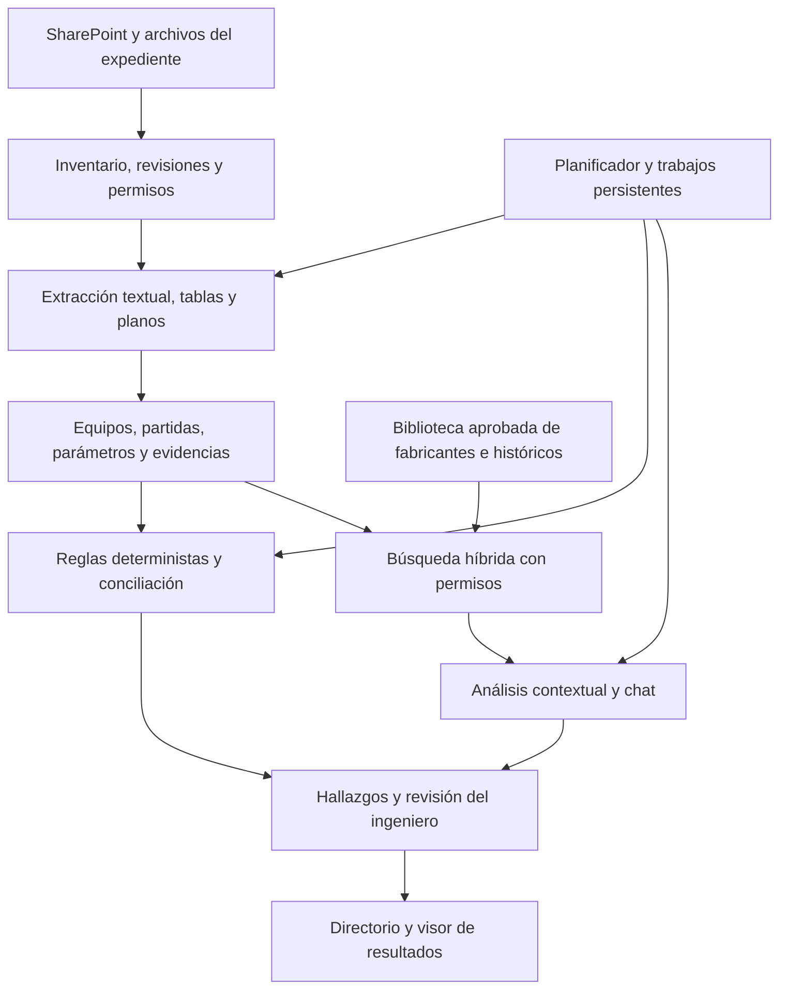

# Auditoría técnica de ECO v0.6.9 y roadmap del nuevo requerimiento

Revisión: 22 de septiembre de 2026. Fuente: copia local autorizada de `eco-propuestas-ai-v0.6.9`, mantenida fuera de este repositorio.

Actualización de alcance: las decisiones propuestas tras la aclaración del solicitante están en [ARQUITECTURA_OBJETIVO.md](ARQUITECTURA_OBJETIVO.md). El piloto de planos prioriza PDF multimodal directo y costeo; la integración CAD no es prerrequisito. La carga manual es entrada inicial y SharePoint queda como fuente complementaria. LibreChat es candidato para el chat, no una integración ya implementada. Las estimaciones de este documento deben rebasarse al cerrar esa integración y el alcance de SSO.

## Conclusión ejecutiva

El código entregado es una aplicación Python con FastAPI, interfaz JavaScript sin framework y un orquestador propio. No utiliza LangChain ni LangGraph en las dependencias o implementaciones inspeccionadas. Los modelos se invocan directamente mediante los SDK de OpenAI y Anthropic.

Su fortaleza reutilizable es la metodología documental: configuración de prompts y rúbricas, extracción por etapas, hallazgos, dependencias, trazabilidad, telemetría y visor. El nuevo producto requiere además un modelo estructurado de equipos y costeos, reglas deterministas, interpretación de planos, conocimiento consultable y ejecución persistente para mayor volumen.

No basta modificar los prompts. Tampoco es necesario sustituir todo el producto ni migrar a LangChain para empezar.

## 1. Alcance y grado de certeza

- `_version.json` declara versión 0.6.9, build 354, commit c712c74, estampado el 22 de junio de 2026. Son metadatos del paquete, no una comprobación del despliegue actual.
- Se inspeccionaron dependencias, contenedor, API, llamadas LLM, extracción, selección de contexto, cobertura, ejecución y coordinación frontend, configuración, persistencia y documentación de decisiones.
- Se validó sintaxis de los 25 archivos Python y parseo de 11 archivos JSON del paquete: sin errores en esos controles.
- Se ejecutaron dos funciones reales de ingesta, extraídas del código por AST, contra un Excel sintético: se reprodujeron pérdida de un cero, ausencia del resultado de una fórmula sin valor cacheado y falta de localizador de fila.
- No se arrancó la aplicación completa, no se usaron credenciales ni modelos, no se procesaron expedientes reales y no se midieron carga, precisión o tiempos operacionales.
- No se encontraron suites de pruebas en el paquete entregado. La documentación menciona scripts y laboratorios que no están incluidos; esto no demuestra que el autor no tenga pruebas en su repositorio completo.
- No se modificó el código entregado. Los scripts y resultados auxiliares de revisión se retiraron posteriormente por solicitud del usuario.

Las verificaciones describen lo ejecutado durante la auditoría original. Los utilitarios auxiliares se retiraron del estado actual del repositorio; no se ofrece aquí un comando de reproducción vigente.

## 2. Arquitectura confirmada en código

| Capa | Implementación comprobada | Evidencia relativa a la raíz del paquete |
| --- | --- | --- |
| Runtime | Python 3.11 en Docker | `engine/Dockerfile:4` |
| API | FastAPI y Uvicorn | `engine/backend/main.py`, `engine/requirements.txt` |
| Interfaz | HTML/CSS/JavaScript, navegación hash, modelo/vista propios | `engine/frontend/app.js`, `centro2_model.js`, `centro2_view.js` |
| Orquestación de análisis | Funciones Python para ingesta, MAP, consolidación temática, síntesis y cobertura | `engine/backend/pipeline/executor.py:3599` |
| Secuencia global | El navegador calcula pendientes y ejecuta partes mediante API | `engine/frontend/centro2_view.js:1302` |
| Invocación LLM | SDK directo, llamadas en threads mediante asyncio; reintentos y telemetría propios | `engine/backend/llm.py:250`, `:335`, `:363` |
| Prompts | Markdown dividido en secciones y cargador propio; JSON de configuración/rúbricas | `engine/backend/pipeline/schemas.py`, `config/skills/` |
| Extracción | PyMuPDF, python-docx y openpyxl | `engine/backend/pipeline/executor.py:2158` |
| Contexto | Roles, palabras clave, presupuestos y lotes | `engine/backend/pipeline/chunker.py:72`, `:237`, `:472` |
| Persistencia | Archivos por caso: JSON, JSONL, auditoría y exportación JS | `executor.py`, `export_utils.py`, `docs/modelo-de-datos.md` |
| Ejecuciones activas | Diccionarios en memoria y asyncio.create_task | `executor.py:167`, `routers/runs.py` |
| Reporte | HTML/CSS/JS autocontenido y datos exportados | `visor-template/`, `engine/backend/export_utils.py` |
| Documentos | Filesystem local/montado; admite carpeta sincronizada externamente | `routers/filesystem.py:34`, `docker-compose.yml` |
| Despliegue | Un servicio web en Compose, volúmenes de datos y documentos | `docker-compose.yml`, `engine/Dockerfile` |

La interfaz de nodos no demuestra agentes autónomos. En esta versión la secuencia y las operaciones las determina el código/configuración; el modelo resuelve tareas delimitadas de extracción y análisis.

### RAG, MCP y SharePoint

**No se encontró una implementación de índice vectorial, embeddings, BM25 ni servidor MCP en el código entregado.** Existe selección de contexto documental por roles y palabras clave. El ADR 0020 propone recuperación híbrida para cobertura, pero declara explícitamente «implementación pendiente»; `_run_coberturas_directed` sigue reutilizando el contexto de oferta seleccionado en sucesivas llamadas.

**No se encontró un conector nativo de SharePoint/Microsoft Graph.** El selector navega el filesystem. Una carpeta sincronizada por otro componente puede servir de entrada, pero ese mecanismo no implementa por sí solo permisos por usuario, sincronización de eliminaciones ni versiones de SharePoint dentro del producto.

## 3. Brechas que afectan directamente al nuevo producto

### 3.1 Excel: la ingesta actual es textual, no una auditoría de cálculo

En `executor.py:2198`, `load_workbook(data_only=True, read_only=True)` lee valores guardados. No conserva fórmulas para auditarlas ni las recalcula.

En `executor.py:2216`, `str(c).strip() if c else ""` convierte un cero numérico en texto vacío. Se omiten también filas cuyo texto resultante sea corto. La heurística de cabecera exige tres celdas no vacías, lo que necesita validación para plantillas heterogéneas.

La prueba sintética incluyó una bomba con cantidad 0, precio 100 y fórmula `=B2*C2` sin resultado cacheado. El fragmento conservó descripción y precio; omitió cantidad y subtotal. Además, los fragmentos XLSX de esta función llevan hoja pero no fila ni celda, pese al esquema general de trazabilidad descrito en documentación.

**Acción:** lector específico de costeo que conserve dirección de celda, fórmula, valor guardado, tipo, unidad y relaciones. Motor de recálculo compatible cuando sea necesario, junto con reglas explícitas de subtotal, redondeo, descuentos y moneda. No ejecutar macros de documentos como parte de la ingesta general.

### 3.2 Planos: detección visual no equivale a interpretación

El PDF se lee con `page.get_text()`, descartando páginas con poco texto. `visual_scan.py` identifica imágenes/densidad y genera avisos; no produce inventarios de equipos ni OCR. Además excluye los roles `oferta_tecnica` y `credenciales` (`visual_scan.py:56`), importante porque el nuevo control se dirige a los planos de la propia propuesta.

**Acción:** prueba temprana de exportación estructurada del fabricante/CAD y, donde no exista, extracción visual con localizadores, validación de TAGs y cobertura por hoja. Separar leyendas, equipos repetidos, revisiones y paquetes. Una transcripción OCR no resuelve por sí sola relaciones y conteo de símbolos.

### 3.3 Mayor volumen: ejecución persistente y datos transaccionales

Existe bloqueo por caso en `routers/runs.py:88`, pero consulta estado de ejecuciones en memoria del proceso. No se debe interpretarlo como bloqueo distribuido ni cola durable. Parte de los resultados y auditorías sí se guarda en disco.

`executeGlobal()` en el navegador solicita las partes sucesivas. Por inspección, cerrar la página puede impedir que se soliciten las siguientes; la tarea ya iniciada en el backend puede continuar. Reiniciar el proceso pierde las tareas en memoria. No se hizo una prueba de interrupción del sistema completo.

**Acción:** trasladar planificación global al servidor, guardar trabajos y estados, agregar workers, reintentos idempotentes, recuperación tras reinicio y control agregado de cuotas. Para múltiples usuarios/casos, migrar estados mutables y relaciones a una base transaccional; conservar documentos/artefactos como archivos u objetos.

Los hashes para deduplicar archivos idénticos y los timestamps entre etapas son útiles, pero no equivalen a un registro completo de revisiones documentales. Se requieren fingerprints de documentos, parser, reglas y prompts para invalidar resultados derivados con precisión.

### 3.4 Identidad y permisos

`INSTALL.md:239` declara que no hay autenticación propia y que se espera protección externa. No se observó autorización por usuario/caso en los routers revisados. El navegador de carpetas acepta rutas resueltas sin imponer allí una raíz autorizada (`filesystem.py:46`).

**Acción:** definir identidad y autorización del nuevo producto, restringir rutas y fuentes, y aplicar permisos también a búsqueda, evidencia, chat y exportaciones. El reporte autocontenido es una copia independiente: revocar acceso al expediente no revoca automáticamente una copia exportada.

### 3.5 Cobertura y biblioteca

El ADR 0020 constituye un buen punto de partida de diseño para búsqueda híbrida y parámetros estructurados. No es una funcionalidad terminada reutilizable.

No debe adoptarse la interpretación «sin resultados recuperados = incumplimiento comprobado». Se necesita distinguir búsqueda sin evidencia, documento no leído, fuente ausente y contradicción demostrada, con pruebas de recuperación y revisión dirigida de posibles faltantes.

### 3.6 Diferencias entre documentación y paquete

Algunas guías declaran `.xls` y trazabilidad por filas. El extractor principal inspeccionado acepta `.pdf`, `.docx`, `.xlsx`; otras listas incluyen `.xls`, generando una inconsistencia de soporte que debe corregirse antes de comunicar compatibilidad. El roadmap toma el código como referencia, no las listas documentales por sí solas.

## 4. Decisión de reutilización

| Decisión | Componentes | Trabajo concreto |
| --- | --- | --- |
| Conservar | FastAPI, adaptador LLM, catálogo de prompts, rúbricas, telemetría y patrones de evidencia | Añadir pruebas de regresión y versionado efectivo por ejecución |
| Adaptar | Clasificación, extracción textual, cobertura y síntesis | Roles y perfil del cliente; evitar mínimos de salida y resultados concluyentes con cobertura incompleta |
| Adaptar | Centro de Proceso y Visor | Bandeja de discrepancias, equipos/partidas, comparación de evidencia, resolución y chat |
| Extraer a módulos | Orquestación y persistencia actualmente concentradas en executor.py | Separar ingesta, workflows, controles, datos y exportación; conservar resultados verificables |
| Sustituir para el nuevo uso | Extractor textual de costeos; scheduler global del navegador; estado activo solo en memoria | Lector estructurado, planificador servidor, cola durable y repositorio transaccional |
| Construir | Equipos, partidas, parámetros, conciliación, reglas, planos y biblioteca | Núcleo funcional nuevo, validado con ingenieros |
| Construir/integrar | SharePoint nativo e identidad, si forman parte del despliegue objetivo | Conector autorizado, sincronización y permisos |
| Opcional posterior | MCP, n8n, cambio de framework de orquestación | Solo si una integración o necesidad operativa concreta lo justifica |

No se recomienda reescribir el frontend en otro framework ni introducir muchos agentes como primer hito. No hay evidencia suficiente para cuantificar un porcentaje de reutilización por esfuerzo.

## 5. Arquitectura objetivo y datos mínimos

Entidades: proyecto, documento/revisión, evidencia, equipo, partida, parámetro, relación equipo-partida, cotización, regla/versión, ejecución, hallazgo, decisión del revisor y fuente de conocimiento aprobada.

Un equipo puede estar en varias evidencias; una partida puede cubrir varios equipos. Las relaciones deben incluir alcance, estado de emparejamiento y evidencia. Evitar equiparar una fila con una unidad física.

Cada hallazgo debe registrar: tipo de control, regla y versión, valores comparados y unidades, fuentes de ambos lados, severidad, certeza de extracción, cobertura, acción sugerida y resolución humana. Una puntuación global no reemplaza estos datos.

Los originales se conservan; el conocimiento validado lleva dueño, estado, vigencia y ámbito. Las propuestas exitosas son antecedentes contextualizados, no reglas técnicas automáticas. Un precio histórico no reemplaza la cotización vigente.

## 6. Roadmap técnico con dependencias y aceptación

Estimación inicial de ingeniería, no compromiso contractual. Supone dos desarrolladores de tiempo completo (backend/datos y full-stack), un ingeniero de procesos disponible para validación semanal y apoyo de QA/IT. Alcance: una familia frecuente, una plantilla de costeo y un formato/exportación de plano, un entorno de cliente. No incluye ingeniería inversa de software propietario, soporte CAD universal ni validación de toda la ingeniería de proceso.

Las fases siguientes se presupuestan de forma secuencial para evitar ocultar trabajo; ciertas tareas podrán solaparse una vez conocido el equipo.

| Fase | Duración orientativa | Entregables | Dependencia y aceptación |
| --- | --- | --- | --- |
| 0. Baseline ejecutable y contrato de datos | 1 semana | Arranque aislado, revisar overrides reales, corpus autorizado, mapa de tareas y controles priorizados | Acceso al paquete completo/configuración sin secretos; referencia humana y criterios de aceptación acordados |
| 1. Prueba de costeos y planos | 1–2 semanas | Extractor XLSX conservando ceros/fórmulas/celdas; prueba de equipos desde exportación o plano | Casos correctos y con errores; medir TAGs, cantidades y cobertura; decidir viabilidad del formato de plano |
| 2. Base operativa del piloto | 2–3 semanas | Persistencia transaccional, trabajos durables, planificador backend, versiones, acceso y conexión de fuentes | Recuperar ejecución tras reinicio; cerrar navegador no interrumpe secuencia; aislar casos y respetar permisos |
| 3. Piloto de controles | 2–3 semanas | Aritmética, cotizaciones, cantidad equipos-partidas, bandeja de revisión y evidencia | Validar contra conjunto reservado; cubrir reservas, paquetes, exclusiones y revisiones; registrar falsos positivos y omisiones |
| 4. Biblioteca y chat | 2–3 semanas | Conocimiento aprobado, índice híbrido, filtros exactos y chat por expediente | Citas sustentadas, permisos y abstención; resultados no recuperados no se convierten automáticamente en brechas |
| 5. Piloto operacional y salida | 2–3 semanas | Pruebas de carga al volumen acordado, seguimiento de ahorro, despliegue, respaldo y operación | Calidad aceptada, costo por propuesta y horas netas medidas; ampliación aprobada por negocio |

**Ventana orientativa total: 10–15 semanas con esos supuestos.** Piloto de controles acotado al finalizar fase 3: aproximadamente 6–9 semanas. No incluye esperas por acceso a SharePoint/identidad, entrega de datos o disponibilidad del experto. Si la fase 1 no logra extracción fiable de los planos, se redefine ese alcance antes de comprometer el plazo: exportación estructurada, confirmación asistida o I+D adicional separado.

### Backlog prioritario de controles

1. Preservar cero frente a vacío; identificar valores/fórmulas ausentes y errores de lectura.
2. Recalcular cantidad por precio y totales conforme a reglas explícitas de la plantilla.
3. Comparar equipos y partidas con relaciones uno-a-muchos y muchos-a-uno.
4. Comparar precio/moneda/vigencia con cotización del mismo modelo y condiciones.
5. Detectar diferencias de parámetros/unidades entre selección, especificación y oferta.
6. Añadir controles técnicos especializados solo con criterios aprobados e información suficiente.

La primera versión publica qué verificaciones soporta y cuáles pudieron ejecutarse. «Sin hallazgos» no significa «sin cualquier tipo de error».

### Validación

Usar expedientes correctos, errores reales conocidos y casos sintéticos de borde. Separar calibración de validación. Medir por control: errores detectados, falsos positivos, errores omitidos, localización correcta de evidencia, cobertura, tiempo del revisor, costo y latencia. Acordar umbrales con el responsable técnico en fase 0; no se presentan porcentajes de precisión sin medición.

Ejemplos obligatorios: cuatro bombas costeadas como dos; bomba repetida en dos planos; dos unidades incluidas en un skid; equipo existente; cantidad cero; fórmula sin valor guardado; precio de cotización vencida; unidades distintas; revisión obsoleta; página ilegible; usuario sin acceso.

## 7. Qué quedó resuelto y qué falta

**Resuelto por inspección:** lenguaje, framework web, ausencia de LangChain/LangGraph, llamadas directas a proveedores, tipo de persistencia, orquestación propia, mecanismo de lectura, límites de planos/Excel, filesystem en vez de conector nativo, RAG pendiente y necesidades operativas para mayor volumen.

**Falta para cerrar una estimación contractual:**

- Nombre y exportaciones del software de fabricantes/CAD; muestras del formato real de plano.
- Plantillas de costeo completas, vínculos y fórmulas; ejemplos de cotizaciones y errores.
- Familia piloto, propuestas/mes, picos, usuarios simultáneos y horas por actividad.
- Criterios del ingeniero para determinar errores y excepciones.
- Entorno de SharePoint, identidad, infraestructura y configuración efectiva del sistema desplegado.
- Disponibilidad del equipo, presupuesto y autorización de reutilización del producto para el nuevo cliente.

La meta de cinco a dos ingenieros sigue siendo una hipótesis operacional: a igual volumen y calidad equivale a reducir 60% de las horas humanas totales. La arquitectura por sí sola no demuestra ese resultado; el piloto debe medir también preparación, consultas, correcciones, falsas alarmas y mantenimiento del conocimiento.
