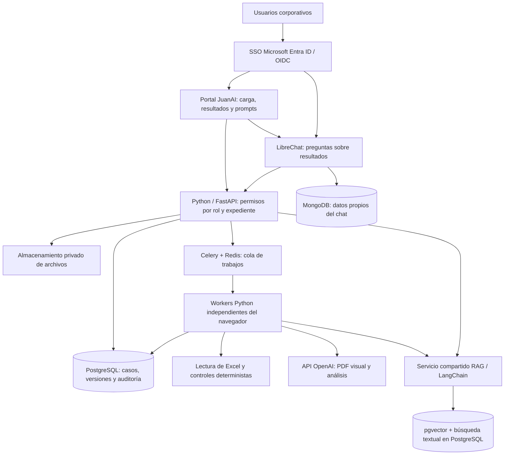

# JuanAI

Plataforma para revisar muchas propuestas de ingeniería, detectar discrepancias entre propuesta, planos y costeo, y consultar resultados respaldados por evidencia.

## Estado

Definición de arquitectura y roadmap. Todavía no hay una aplicación JuanAI implementada, conexión a SharePoint, SSO ni evaluaciones ejecutadas con modelos en este repositorio.

## Arquitectura propuesta

Base seleccionada para implementar el MVP; todavía no desplegada:

SSO autentica la cuenta corporativa; FastAPI autoriza cada expediente, documento, descarga y consulta RAG. El tenant y registro de aplicaciones se configuran con TI. Los permisos del chat deben corresponder con los del backend.

- Python/FastAPI para la aplicación y el servicio de evaluación.
- PostgreSQL y pgvector para datos y recuperación documental, con búsqueda textual complementaria.
- Celery + Redis para procesamiento en workers; PostgreSQL conserva el estado durable de trabajos y resultados. Implementar persistencia, checkpoints, reconciliación y reintentos idempotentes: la cola por sí sola no garantiza recuperación.
- API OpenAI para revisión documental y visual de PDF; cálculos de costeo verificables en código.
- SSO corporativo, roles, auditoría y resultados versionados.
- Prompts editables y conocimiento aprobado antes de reutilizar aprendizajes.
- LibreChat como interfaz de conversación conectada al mismo servicio de conocimiento; MongoDB para sus datos propios.
- LangChain limitado a integración/recuperación RAG; no se requiere migrar el motor completo ni incorporar LangGraph.
- Portal HTML/CSS/JavaScript modular reutilizando componentes del visor ECO y despliegue inicial con Docker Compose en servidor autorizado.

La arquitectura base está seleccionada. Se fijarán versiones al implementar; infraestructura, volumen objetivo y criterios de ingeniería se completan con TI y especialistas. No bloquean iniciar el desarrollo.

## SSO, roles y auditoría

- **Administrador:** usuarios, fuentes, configuración y publicación de prompts.
- **Ingeniero:** carga según permisos, análisis y respuesta a aclaraciones.
- **Revisor técnico/comercial:** valida hallazgos y aprueba conocimiento dentro de su ámbito.
- **Lector/auditor:** consulta autorizada de resultados e historial.

Una persona puede reunir varios roles. Se aplica segregación por expediente/área y confidencialidad, incluidos costos y márgenes. Una acotación del chat no sobrescribe una evaluación aprobada.

## Roadmap basado en el expediente real

Se revisaron siete archivos: DOCX funcional, PFD, corrida de membranas, dos proyecciones químicas visuales y dos libros Excel. Los originales se mantienen fuera de Git.

| Hito | Entregable | Criterio de salida |
| --- | --- | --- |
| 1. Caso real y contratos | Lectura PDF/Excel, controles iniciales y esquema de hallazgos | Evidencias por página/celda y casos revisados por experto |
| 2. Plataforma | SSO, roles, expedientes, almacenamiento y trabajos persistentes | Cerrar navegador/reiniciar worker no pierde seguimiento; permisos verificados |
| 3. Evaluador | Plano-costeo, cantidades, fórmulas, unidades y parámetros | Detectar errores conocidos y comprobar casos correctos |
| 4. RAG y aclaraciones | Fuentes aprobadas, preguntas, respuestas y consolidación | Fuentes vigentes y autorizadas; nueva versión al resolver observaciones |
| 5. Chat y prompts | LibreChat y editor versionado | Mismo corpus y permisos; historial de cambios preservado |
| 6. Piloto operacional | Calidad, carga, tiempos, costos y respaldos | Criterios de aceptación acordados y ahorro medido |
| Posterior | INET/SharePoint automatizados, nuevas familias y borradores de propuesta | Integraciones y plantillas aprobadas; emisión humana |

La generación de propuestas técnico-comerciales queda para una fase posterior, como plantea el documento funcional. El MVP revisa diseño/costeo, formula preguntas y conserva resultados. La estimación histórica de 10–15 semanas es orientativa y se revisará al cerrar el primer hito y la disponibilidad del equipo.

## Conocimiento y parámetros de agua

Separar catálogo común de parámetros, valores del proyecto y reglas/rangos aprobados por aplicación. Las simulaciones recibidas pertenecen a un caso concreto; no se convierten automáticamente en estándares universales. El documento del cliente solicita elaborar y aprobar “Equipos y Criterios de Proceso VF”.

Los resultados automáticos quedan auditados; solo los aprendizajes validados se incorporan como antecedentes aprobados. Cada evaluación conserva versiones de documentos, fuentes, reglas, prompts y modelo.

## Documentación

1. [Arquitectura objetivo](ARQUITECTURA_OBJETIVO.md): alcance vigente y decisiones propuestas.
2. [Auditoría técnica de ECO v0.6.9 y roadmap](AUDITORIA_TECNICA_V069_Y_ROADMAP.md): hallazgos en el código de referencia y estimación condicionada.
3. [Roadmap preliminar](ROADMAP_REVISION_PROPUESTAS.md): análisis previo a recibir el código fuente.
4. [Primer acercamiento](PRIMER_ACERCAMIENTO.md): contexto inicial del proyecto.
5. [Piloto documental](PILOTO_DOCUMENTAL.md): consecuencias de los formatos reales y pruebas iniciales.

Este README y la actualización de la arquitectura objetivo prevalecen sobre alternativas tecnológicas históricas. Los documentos anteriores se conservan para trazabilidad.

## Primer hito

Validar con expedientes representativos el flujo **PDF del plano + costeo → discrepancias con evidencia**, incluyendo casos correctos, cantidades omitidas, paquetes y revisiones diferentes. En paralelo, definir acceso, persistencia y contratos de resultados.

## Convenciones

- Mensajes de los nuevos commits en español; ver [CONTRIBUTING.md](CONTRIBUTING.md).
- No versionar documentos del cliente, datos operacionales ni credenciales.
- Usar muestras sintéticas para pruebas publicadas.

## Referencias técnicas

- [Microsoft Entra ID y OIDC](https://learn.microsoft.com/en-us/entra/identity-platform/v2-protocols-oidc).
- [Celery con Redis](https://docs.celeryq.dev/en/stable/getting-started/backends-and-brokers/redis.html).
- [pgvector](https://github.com/pgvector/pgvector).
- [LibreChat RAG API](https://www.librechat.ai/docs/configuration/rag_api).
