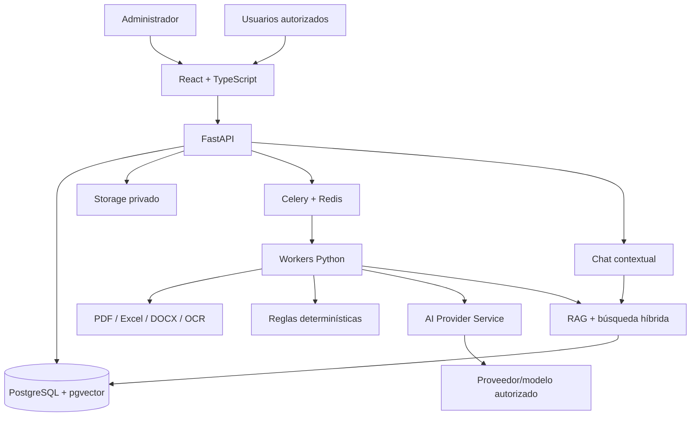

# JuanAI

Plataforma para revisar propuestas de ingeniería, detectar discrepancias entre planos, simulaciones, costeos y antecedentes, y permitir consultas sobre resultados respaldados por evidencia.

## Estado

El proyecto está en fase de arquitectura + GOLDEN-001 / SPIKE-001. Todavía no existe una aplicación MVP desplegada.

## Alcance del MVP

El flujo inicial será intencionalmente simple:

1. Un **administrador** crea el expediente, carga los documentos y ejecuta el análisis.
2. El procesamiento continúa en el servidor mediante workers.
3. Los resultados quedan versionados y almacenados.
4. Los **usuarios autorizados** pueden consultar resultados y evidencia.
5. Los usuarios pueden realizar preguntas mediante un **chat contextual** del expediente.
6. Solo el administrador puede validar/corregir hallazgos y volver a ejecutar el análisis.

Los usuarios normales del MVP no cargan documentos ni ejecutan procesos.

## Arquitectura objetivo

```mermaid
flowchart TD
    A[Administrador] --> UI[React + TypeScript]
    U[Usuarios autorizados] --> UI
    UI --> API[FastAPI]
    API --> DB[(PostgreSQL + pgvector)]
    API --> FS[Storage privado]
    API --> Q[Celery + Redis]
    Q --> W[Workers Python]
    W --> DOC[PDF / Excel / DOCX / OCR]
    W --> RULES[Reglas determinísticas]
    W --> AI[AI Provider Service]
    AI --> MODEL[Proveedor/modelo autorizado]
    W --> RAG[RAG + búsqueda híbrida]
    RAG --> DB
    API --> CHAT[Chat contextual]
    CHAT --> RAG
```

## Stack

- **Frontend:** React + TypeScript + Vite + Tailwind.
- **Backend:** FastAPI + Pydantic + SQLAlchemy + Alembic.
- **Base de datos:** PostgreSQL.
- **RAG:** PostgreSQL + pgvector + búsqueda textual.
- **Procesamiento asíncrono:** Celery + Redis.
- **PDF:** PyMuPDF + ruta visual/OCR cuando corresponda.
- **Excel:** openpyxl + reglas propias.
- **DOCX:** python-docx.
- **IA:** capa propia AI Provider Service con structured outputs/tool calling.
- **Identidad:** Microsoft Entra ID / OIDC.
- **Autorización:** RBAC en backend.
- **Infraestructura:** Docker Compose + Nginx + CI sobre VM/servidor autorizado.

## Decisiones de arquitectura

- PostgreSQL será la fuente de verdad.
- MongoDB no es necesario para el MVP.
- LibreChat no es una dependencia obligatoria.
- MCP no forma parte del MVP.
- LangChain, si se utiliza, queda limitado al servicio RAG.
- El modelo no accede directamente al filesystem, PostgreSQL ni storage.
- Los documentos originales permanecen en almacenamiento privado y fuera de Git.
- La API/proveedor/modelo de IA exactos se definen con TI y quedan desacoplados de la lógica de negocio.

## Regla principal

La IA interpreta; el código verifica.

Se resuelven de forma determinística en Python:

- cálculos;
- cantidades;
- tolerancias;
- fórmulas;
- referencias Excel;
- costeo;
- permisos;
- versionado.

La IA se utiliza para interpretar planos/documentos, relacionar contexto, generar salidas estructuradas, formular preguntas y responder mediante RAG.

## Primer hito

El primer desarrollo es **GOLDEN-001 / SPIKE-001**, usando un expediente real para validar:

- PFD ↔ simulación;
- PFD ↔ costeo;
- simulación ↔ costeo;
- costeo ↔ APU;
- caudales;
- cantidades y modelos de equipos;
- membranas/portamembranas;
- fórmulas y referencias rotas;
- evidencia por página/celda.

Los documentos originales del cliente no se versionan en este repositorio.

## Documentación

1. [Arquitectura objetivo](ARQUITECTURA_OBJETIVO.md)
2. [Piloto documental](PILOTO_DOCUMENTAL.md)
3. [GOLDEN-001](docs/pilot/golden-001/)
4. [Auditoría técnica de ECO v0.6.9 y roadmap](AUDITORIA_TECNICA_V069_Y_ROADMAP.md)
5. [Roadmap preliminar](ROADMAP_REVISION_PROPUESTAS.md)
6. [Primer acercamiento](PRIMER_ACERCAMIENTO.md)

Los documentos históricos se mantienen para trazabilidad; este README y `ARQUITECTURA_OBJETIVO.md` representan la definición vigente.
